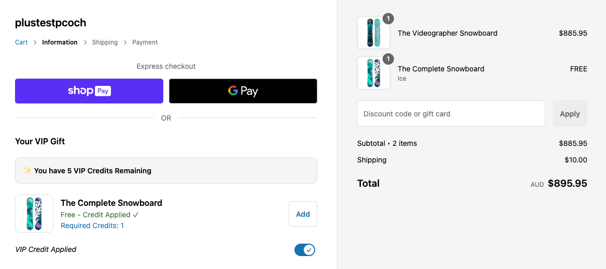

# Demo

[Live store](https://plustestpcoch.myshopify.com/)

# Why build custom?

Checkout Blocks but Upsell components are now legacy.
Apps like https://apps.shopify.com/anvil-checkout which support upsells, but they don’t have functionality to set custom logic like “only render if customer metafield = x"

# How this app works

- Checkout UI extension queries API to pull in a specific VIP product
- Checkout UI checks customer metafield for total credit value
- Switch toggle component updates UI to show credit and toggles a line item attribute on the gift
- Cart Transform Function reads the attribute and runs update operation to reduce price to $0

# Things this MVP omits

- Doesn't deduct from customer metafied is credit used (this is doable though)
- No UI for removing gift once added - this could easily be fixed with Checkout Blocks (it can add in qty selectors)
- Some react bugs with credit value updating need fixing...
- Setting for user to select which VIP product is queries and rendered (currently hard coded)
- Feedback messages when credits are applied/removed (Disable the "Add" button if customer doesn't have enough credits)

# More features to add

**Error Handling, Validation, Data Integrity:**
Ensure customer can't logout and still get offer
When customer checksout, update the customer metafield
Validate credit balance before each operation
Ensure credits can't go negative
What happens if customer removes and re-adds the product?

**User Experience:**
Feedback messages when credits are applied/removed

**Business Logic:**
Should there be a limit on how many VIP products per order?

**Technical Improvements:**
Add TypeScript interfaces for all data structures
Add error boundaries for React components
